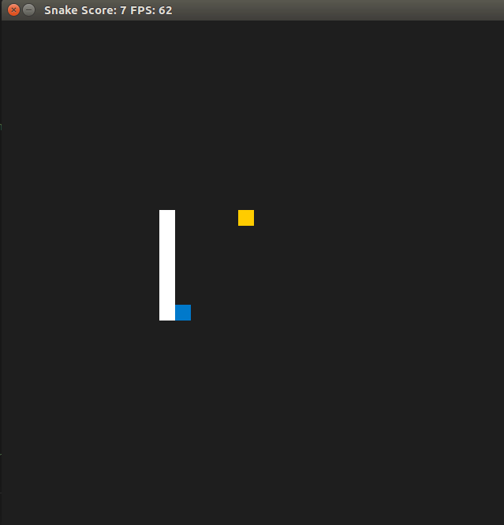

# CPPND: Capstone Snake Game Example

This is a starter repo for the Capstone project in the [Udacity C++ Nanodegree Program](https://www.udacity.com/course/c-plus-plus-nanodegree--nd213). The code for this repo was inspired by [this](https://codereview.stackexchange.com/questions/212296/snake-game-in-c-with-sdl) excellent StackOverflow post and set of responses.



The Capstone Project gives you a chance to integrate what you've learned throughout this program. This project will become an important part of your portfolio to share with current and future colleagues and employers.

In this project, you can build your own C++ application or extend this Snake game, following the principles you have learned throughout this Nanodegree Program. This project will demonstrate that you can independently create applications using a wide range of C++ features.

## Dependencies for Running Locally

* cmake >= 3.7
  * All OSes: [click here for installation instructions](https://cmake.org/install/)
* make >= 4.1 (Linux, Mac), 3.81 (Windows)
  * Linux: make is installed by default on most Linux distros
  * Mac: [install Xcode command line tools to get make](https://developer.apple.com/xcode/features/)
  * Windows: [Click here for installation instructions](http://gnuwin32.sourceforge.net/packages/make.htm)
* SDL2 >= 2.0
  * All installation instructions can be found [here](https://wiki.libsdl.org/Installation)
  * Note that for Linux, an `apt` or `apt-get` installation is preferred to building from source.
* gcc/g++ >= 5.4
  * Linux: gcc / g++ is installed by default on most Linux distros
  * Mac: same deal as make - [install Xcode command line tools](https://developer.apple.com/xcode/features/)
  * Windows: recommend using [MinGW](http://www.mingw.org/)
* conan
  * All OSes: [click here for installation instructions](https://docs.conan.io/en/latest/installation.html)
* nas: The Network Audio System
  * All OSes: [click here for installation instructions](https://radscan.com/nas.html)

## Basic Build Instructions

1. Clone this repo.

```bash
git clone https://github.com/Horki/CppND-Capstone-Snake-Game
```

2. Make a build directory in the top level directory: `mkdir build && cd build`
3. Add Remote. `conan remote add bincrafters "https://api.bintray.com/conan/bincrafters/public-conan"`
4. Build with conan. `conan install .. --build missing -s compiler.libcxx=libstdc++`
5. Compile: `cmake .. && make`
6. Run it: `./bin/SnakeGame`.
